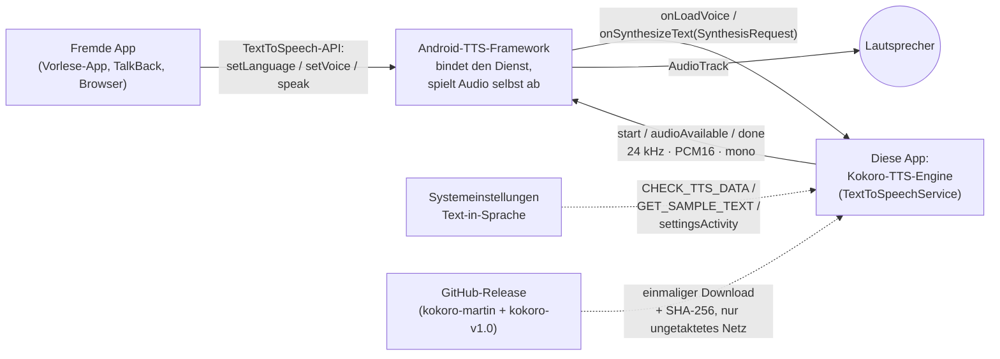
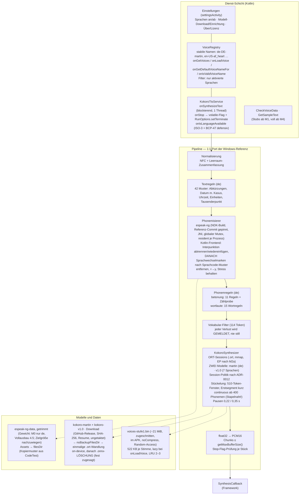

# PROJEKTPLAN — Kokoro-TTS-Engine für Android

**Projekt:** Portierung der vermessenen Windows-Kokoro-Pipeline als eigenständige Android-System-TTS-Engine (`android.speech.tts.TextToSpeechService`)
**Arbeitsverzeichnis:** `C:/Users/jtill/Documents/_Claude/TTS Android Standalone`
**Referenz (nur lesen):** `C:/Users/jtill/Documents/_Claude/TTS Test` (Windows-Pipeline), `C:/Users/jtill/Documents/_Claude/CodeTest` (erprobte Android-Muster)
**Stand:** 2026-08-24 · **Endfassung nach Einarbeitung der drei Prüfberichte** · Grundlage: Recherchefelder 1–5 (ab Commit 1 als Dateien unter `docs/recherche/`)

**Leitsatz (ADR-0001):** Die eigene, auf Windows vermessene Pipeline wird 1:1 portiert — nicht neu erfunden, nicht durch fremde Kokoro-Frontends (sherpa-onnx) ersetzt. Der historische ich-Laut-Fehlschlag („itsch") entstand im Integrationsweg, nicht im Modell; jede Abweichung vom vermessenen Pfad ist ein Risiko, das durch Golden-File-Tests sichtbar gemacht wird. **Neu präzisiert:** Das Stopp-Gate dieses Leitsatzes steht jetzt in einem eigenen Meilenstein M0 „Prüfstein" — **vor** jedem Service-Bau.

---

## Änderungen gegenüber dem Entwurf

1. **Zwei-Modell-Realität eingearbeitet (blockierender Fund):** Deutsch läuft über `kokoro-martin.onnx` (~311 MiB fp32 + `voices-martin.npz`, belegt im Altprojekt unter `modell/`), die 7 übrigen Sprachen über `kokoro-v1.0.onnx` (~311 MiB). Abschnitt 6 ist vollständig auf zwei Modelle umgerechnet; neues **ADR-0012** (Session-Politik, offen bis M2a) samt Messpunkten „Sprachwechsel: Zeit + mAh" und **Ein-Modell-Hypothese** (Martin × v1.0-Stimmvektoren).
2. **M0 „Prüfstein" abgespalten:** ich-Laut-A/B und Phonemgleichheit werden ohne Service-Schicht bewiesen (WAV per adb pull); das Projekt-Stopp-Gate liegt in M0. M1 ist nur noch das Service-Skelett — inklusive vorgezogener **CheckVoiceData/GetSampleText-Stubs**.
3. **Golden-Tests zweistufig:** Stufe A Roh-espeak (geprüft über Host-Build desselben gepinnten espeak-Commits als Windows-DLL in JVM-Tests, plus Instrumented-Stichprobe am Gerät), Stufe B Frontend (rein JVM). Neue Aufgabe 0.2: **den espeak-Commit hinter espeakng-loader 0.2.4 ermitteln und beidseitig pinnen** — sonst kann das Gate als Fehlalarm feuern.
4. **M2 geteilt:** M2a Messung/Variante (Modelle per adb push, ohne Downloader), M2b Modellbezug — erst nach ADR-0004-Nachtrag und entschiedenem F1/F7; M2b fällt mit der Einstellungs-Activity (4.4) zusammen, die „Settings-Rohform" entfällt.
5. **Referenzhoheit geregelt (neues ADR-0013):** Ab M3-Abnahme ist das Kotlin-Regelwerk die einzige Wahrheit; Windows-Ära-Goldens werden eingefroren (`golden/frozen-windows/`); Golden-Generator und Mess-Skripte (K-Kennzahl, F0) wandern als Python-Werkzeuge ins neue Repo.
6. **Lizenz-Compliance ab Commit 1:** LICENSE (GPL-3.0-or-later), SPDX-Konvention, NOTICE-/THIRD_PARTY_NOTICES-Skelett, inbound=outbound + DCO. **Martin-Beleg-Dossier** `docs/lizenz/martin-kette.md` im ersten Commit; **F1 ist Gate vor M2b**, bis dahin bleibt jedes Release mit Modelldateien Draft/privat.
7. **Energie elektrisch messbar gemacht:** mAh je 1000 Zeichen je Matrixzeile, Entlade-Delta der 30-min-Strecke, Standby-Drift = 0, Wandlungs- und Wiederaufwachkosten, PSS-Aufriss (private dirty vs. file-backed), Spinning-Kontrollpunkt je EP — alle nicht am Kabel.
8. **Stop-Pfad vertieft:** `RunOptions.setTerminate()` zusätzlich zum volatile-Flag; Stresstest „Stop mitten im langen Run"; Segmentlänge (kurzes Erstsegment vs. continuous) als eigener Mess-Parameter.
9. **Unbelegte Zahlen entschärft:** „+75 % CPU" als Herstelleransage markiert, .ort-Init- und Timer-Zahlen als Prognosen, Play-Transport-Zeile gestrichen, Budgetgrenzen erst nach M2a/M5 verbindlich, Abschnitt 6 als **Flaggschiff-Korridor** gekennzeichnet.
10. **voices-Datei:** nicht im Git; per versioniertem Skript auf die Stufe-1-Stimmen zugeschnitten (41 + martin ≈ 21 MiB), `noCompress` + Random-Access, kleiner LRU-Vektor-Cache; Downloader mit Metered-Schranke; Varianten-Default nach Gerätekasse.
11. **Prozesse und Orte:** Recherchefelder 1–5 als Dateien in `docs/recherche/`; Diagramme leben nur in `docs/architektur.md` (der Plan hält Momentaufnahmen); CI (JVM-Tests + Lint) ab dem ersten Commit; F-Droid auf „zu prüfen" zurückgestuft; espeak-Lebenszyklus festgeschrieben (resident, `terminate` nur in `onDestroy`).
12. **Frontend-Falle entschärft:** Die im Entwurf notierte remove-flags-Regex `\(.+?\)` ist ersetzt durch ein Sprachcode-Muster **nach** der Interpunktions-Abtrennung; Klammer-plus-Sprachwechsel-Prüfsätze sind Pflicht im Golden-Korpus.
13. **Gates statt geparkter Fragen:** F3/F5 vor M0, F7 vor 2a.3, F1 vor M2b; neues F8 (Repo-Sichtbarkeit). Gesamtaufwand ehrlich auf **~39–59 Personentage** erhöht (Mehrarbeit aus Compliance und Messpflichten).

---

## 1. Ziele und Nicht-Ziele

### 1.1 Ziele (Ausbaustufe 1 = Version 1.0)

| Nr. | Ziel | Messbar durch |
|---|---|---|
| Z1 | **Vollwertiger System-TTS-Ersatz:** fremde Apps (Vorlese-Apps, TalkBack, Browser) wählen per `setLanguage`/`setVoice` gezielt Sprache und Stimme; die Engine erscheint in den Systemeinstellungen unter „Text-in-Sprache-Ausgabe" | Kompatibilitätstest mit mindestens drei realen Clients (M4); Sprachwechsel de↔andere ausdrücklich mitgetestet (zwei Modelle!) |
| Z2 | **Phonemgleichheit mit der Windows-Referenz:** identische Phonemketten für den Golden-Korpus auf beiden Golden-Stufen (Roh-espeak, Frontend), hörbar sauberer deutscher Klang (ich-Laut!) | Zweistufige zeichengenaue Golden-Tests + Hörprobe gegen Windows-WAVs (**M0**, fortlaufend) |
| Z3 | **8 Sprachen über espeak-ng-G2P:** de über den Martin-Fine-Tune (`kokoro-martin.onnx`, 1 Stimme), en-us, en-gb, es, fr-fr, it, pt-br, hi über `kokoro-v1.0.onnx` (41 Stimmen) | `onGetVoices` + Systemeinstellungen (M4) |
| Z4 | **Sprachen in den Einstellungen an-/abwählbar** (RHVoice-Muster: abgewählte Sprachen verschwinden aus `onGetVoices`, `CheckVoiceData`, `onIsLanguageAvailable`) | Einstellungs-Activity + Filtertest (M4) |
| Z5 | **Aussprachefehler leicht einpflegbar:** Regelwerke (textregeln 42 Muster, betonung 11, wortlaute 15, Lautersatz) datennah portiert; jede neue Regel = ein Tabelleneintrag + ein Golden-Test; Issue-Vorlage „Ausspracheregel melden"; der volle Weg (Issue → Reproduktion → ggf. Messung → Regel + Golden → Release) ist dokumentiert | CONTRIBUTING-Abschnitt + Vorlage + regelwerk.md (M3/M6) |
| Z6 | **Wenig RAM und Energie — elektrisch belegt:** PSS-Korridor eingehalten, mAh je 1000 Zeichen erhoben, 30-min-Entladung gemessen, Standby-Drift = 0, keine Wakelocks, kein Thread-Spinning | Gerätemessungen SM-F971B, nicht am Kabel (M2a, M5) |
| Z7 | **Phonemverluste bleiben sichtbar:** der 114er-Vokabularfilter meldet jeden entfernten Laut (Log + optional Entwickleranzeige), niemals still | Unit-Test auf den Verlustbericht (M0) |
| Z8 | **OpenSource-Veröffentlichung:** GPL-3.0-or-later ab Commit 1, vollständige Third-Party-Notices, reproduzierbarer Build, CI, GitHub-Release mit APK | M6 (Vollständigkeitsprüfung; die Artefakte existieren ab M0) |
| Z9 | **Doku als Projektgedächtnis:** deutsche Tiefendoku (Architektur, Erkenntnisse, Regelwerk), gepflegtes Mermaid-Blockdiagramm **an genau einem Ort** (`docs/architektur.md`), ADRs, Recherchefelder als Dateien | Definition of Done, Punkt 4 (jeder Meilenstein) |

### 1.2 Nicht-Ziele der Ausbaustufe 1 (ausdrücklich)

- **Kein Japanisch, kein Chinesisch.** misaki ist reines Python; zh (jieba + pypinyin + pinyin_to_ipa, ~4–6 Tage, ~4 MB Daten) kommt früh in Stufe 2, ja (Kuromoji-Weg, ~5–8 Tage, ~13 MB) danach (ADR-0003). Die ja/zh-Stimmen werden in Stufe 1 **nicht angeboten und nicht mitgeliefert** — die voices-Datei wird auf die angebotenen Stimmen zugeschnitten (ADR-0005).
- **Keine Tonhöhensteuerung.** `SynthesisRequest.getPitch()` ≠ 100 wird in Stufe 1 ignoriert (dokumentiert). Die Windows-PSOLA-Stufe (Praat, GPL-Werkzeug, nicht portierbar) wird in Stufe 2 durch eine **eigene TD-PSOLA-Implementierung** ersetzt (kein Praat-Code; Algorithmus patentfrei) — siehe F2. `getSpeechRate()` **wird** unterstützt (→ Kokoro-`speed`).
- **Kein Wort-Highlighting (`rangeStart`).** Kokoro liefert keine Wort-Audio-Alignments; eine Näherung wäre unehrlich. Vorbereitet durch minSdk 26, umgesetzt frühestens Stufe 3.
- **Keine eigene Audio-Wiedergabe.** Das Framework spielt ab (`PlaybackSynthesisCallback` → AudioTrack); `SpeechOutput.kt` aus CodeTest wird nicht gebraucht.
- **Kein Play-Store-Release in Stufe 1.** Vertrieb zunächst als GitHub-Release-APK (Sideload); F-Droid in Stufe 2 **nur nach Prüfung der Inclusion-Policy** (Abschnitt 4, Stufe 2), Play offen (F6). Kein On-Demand-Play-Asset-Delivery (Play-Core-Bibliothek ist GPL-unverträglich, `docs/recherche/feld4`).
- **Keine Gewichte im Git und keine Modelle im APK.** Beide ~311-MiB-Modelle kommen per Eigen-Download mit SHA-256 (ADR-0005); auch die voices-Datei ist ein Build-Artefakt aus `models.json`, kein Git-Inhalt.
- **Keine Netzabhängigkeit im Betrieb.** Internet nur für den einmaligen Modell-Download; danach vollständig offline (`requiresNetworkConnection = false`). Download standardmäßig nur über nicht getaktetes Netz, Mobilfunk per bewusstem Opt-in.
- **Keine Bitstabilität der Audioausgabe.** Der Vokoder enthält seedlose Zufallsknoten (Windows-Befund, klanglich folgenlos) — Audio-Regressionstests vergleichen deshalb Phonemketten und Kenngrößen, nie Samples.
- **Nur arm64-v8a** (F5, Gate vor M0): 32-Bit-Geräte tragen zwei 311-MiB-Modelle ohnehin nicht sinnvoll; armeabi-v7a kostete +13 MiB APK.

---

## 2. Architektur im Blockdiagramm

> **Ort der Wahrheit:** Ab Commit 1 leben die gepflegten Diagramme ausschließlich in `docs/architektur.md`; die folgenden Fassungen sind die **Momentaufnahme zum Planungsstand** und werden im Plan nicht weitergepflegt (Pflegeregel 7.3).

### 2.1 Kontext (C4-Ebene 1)



Kernpunkte des Vertrags (`docs/recherche/feld1`): `onSynthesizeText` läuft blockierend auf genau **einem** Synthese-Thread; `onStop` kommt von einem **anderen** Thread (→ volatile-Abbruchflag **und** `RunOptions.setTerminate()`, denn die teure Einheit ist der Modell-Run, nicht der PCM-Chunk); `audioAvailable` blockiert bei vollen Puffern (eingebaute Backpressure = Energiesparen — sie wirkt allerdings nur **zwischen** Modell-Runs, weshalb die Segmentlänge ein eigener Mess-Parameter ist); Chunks ≤ `getMaxBufferSize()` (8192 Bytes im Wiedergabepfad, immer abfragen); Sprachcodes kommen als **ISO-3** an (`"deu"`); nach Stop liefert `audioAvailable` den Rückgabewert `STOPPED`.

### 2.2 Bausteine (C4-Ebene 2/3 — der Pipeline-Kern ist das Wertzentrum)



Die Textregel-Schicht ist sprachabhängig (Stufe 1: nur de vollständig; andere Sprachen laufen roh durch espeak — wie heute auf Windows). Für Nicht-de-Sprachen entfallen TXT/PR, NORM/PHON/VOC/KOK gelten immer.

**Querschnittsfestlegung espeak-Lebenszyklus (neu):** espeak wird **einmal je Prozess** initialisiert und bleibt resident; `setVoice` nur bei tatsächlichem Sprachwechsel; `espeak_Terminate` ausschließlich in `onDestroy`. Der Leerlauf-Timer (M5) entlädt **nur** ORT-Sessions, nie espeak. Der residente RAM-Anteil wird in M2a einmal gemessen und steht als eigene Zeile im Korridor 6.2.

**Pflegeregel Diagramme:** Gepflegt wird ausschließlich `docs/architektur.md`, bei jeder Architekturänderung **im selben Commit** (Definition of Done, Punkt 4). Ein einmaliges Komponentendiagramm des Pipeline-Kerns entsteht in M3 und wird nur bei Pipeline-Umbauten angefasst. Mermaid-`flowchart`-Syntax, nicht die experimentelle C4-Syntax; > 15 Knoten → aufteilen.

---

## 3. Grundsatzentscheidungen (ADR-Liste)

Ablage: `docs/adr/NNNN-titel.md`, Nygard-Format (Titel, Status, Kontext, Entscheidung, Konsequenzen), unveränderlich, Ersetzung nur durch neues ADR.

| ADR | Titel | Entscheidung | Begründung | Verworfene Alternativen |
|---|---|---|---|---|
| **0001** | Eigene vermessene Pipeline statt sherpa-onnx-Kokoro-Frontend | Der komplette Windows-Pfad (Textregeln → espeak → Phonemregeln → Vokabularfilter → Kokoro) wird selbst portiert; sherpa-onnx wird **nicht** eingebunden. Das Stopp-Gate liegt in M0 | Kokoro lief schon einmal via sherpa auf Android und wurde wegen des zerstörten ich-Lauts verworfen; das Modell spricht mit espeak nachweislich sauber — der Fehler lag im Integrationsweg (Verdacht tokens.txt-Filterung, durch Quelltextlektüre gestützt). sherpa kann zudem kein ja und löst zh per Greedy-Lexikon statt Segmentierung | sherpa-onnx-AAR (schneller Start, aber genau der belegte Irrweg); piper-phonemize (eingefroren, keine Android-Builds) |
| **0002** | espeak-ng per NDK-Build, **auf den Referenz-Commit gepinnt** → Projektlizenz **GPL-3.0-or-later** | Eigener CMake/NDK-Build (Schalterbelegung nach sherpa-Vorlage: USE_ASYNC/MBROLA/KLATT … OFF), gepinnt auf **den espeak-ng-Stand hinter espeakng-loader 0.2.4** (Aufgabe 0.2; Rückfallebene: Windows-Goldens mit dem gewählten Commit neu erzeugen). Dünnes JNI (~150 Zeilen) um `espeak_TextToPhonemes` (phonememode: IPA-Bit 0x02, Separator-Bits), globaler Mutex, resident je Prozess (Querschnittsfestlegung in 2.2). Damit wird die App GPL-3.0 (kombiniertes Werk, keine Linking-Exception); LICENSE und Notices liegen **ab Commit 1** im Repo | Kokoro ist auf espeak-Phoneme trainiert; jeder G2P-Wechsel ist exakt die Fehlerklasse von damals. Wörterbücher ändern sich zwischen espeak-Ständen — ohne Commit-Gleichheit ist „zeichengenau" nicht prüfbar. GPL-TTS-Engines sind gelebte Praxis (espeak-ng-App, RHVoice) | gruut (MIT, aber archiviert, ohne hi/pt); goruut (MIT, andere Phonemkonventionen = unvermessenes Qualitätsrisiko); epitran (keine Betonung) |
| **0003** | ja/zh gestuft, nicht in Stufe 1 | Stufe 1 liefert die 8 espeak-Sprachen. Stufe 2 beginnt mit zh (Kotlin-Port des misaki-Legacy-Pfads, ~4–6 T), danach ja (Kuromoji-ipadic + HEPBURN-Tabellenport, ~5–8 T, ~13 MB) | misaki ist reines Python; ja über espeak ist unbrauchbar („Chinese letter"), zh verlöre 19 %. Der zh-Legacy-Pfad hat keine Ton-Sandhi → Parität billig erreichbar; ja hat das unidic-Gewichtsproblem | MeCab+unidic-lite als 47-MiB-Download (Rückfallebene, dokumentiert); sherpas zh-Lexikon + Greedy-Matcher |
| **0004** | Modellvariante **per Messung**, nicht per Annahme | Status: **offen bis M2a.** Pflichtmatrix {fp32, fp16, ggf. int8 (F7)} × {CPU-EP, XNNPACK} × Threads {1,2,4} auf dem SM-F971B: RTF kalt/eingeschwungen, PSS **mit Aufriss private dirty vs. file-backed** (dumpsys meminfo), Hauttemperatur, **mAh je 1000 Zeichen**, Spinning-Kontrollpunkt (CPU = 0 % zehn Sekunden nach Run-Ende, je EP). Tempo-/RAM-Zeilen laufen einmal auf v1.0; das **Hör-Gate (ich-Laut-Prüfsatz) läuft je Variante und je Modell** — martin und v1.0 sind grafgleiche Geschwister, Leistungswerte übertragen sich, Klang nicht zwingend. Falls Martin nicht als fp16/int8 vorliegt: eigene Konvertierung als Messkandidat oder fp32-only für de dokumentieren. Standardwahl im Einrichtungs-UI nach Gerätekasse (`ActivityManager.MemoryInfo`/`isLowRamDevice`) | Gemessene Widersprüche verbieten Raten: int8 war am Gerät **langsamer** als fp32 (RTF 0,84–0,93 vs. 0,70–0,74); fp16 halbiert die Dateigröße, die RAM-Halbierung ist **unbelegt** (Cast-Paar-Risiko, Supertonic-Befund: +54 % Zeitkosten); welcher EP gewinnt, ist je Graph unvorhersehbar | Blind fp16 „weil kleiner"; int8 „weil schnell" (beides durch Messungen widerlegt bzw. ungedeckt); Ein-Default-für-alle-Geräte |
| **0005** | Modellbezug: Eigen-Download von GitHub-Release, kein LFS, keine Gewichte im Git/APK | Repo enthält nur Prüfsummen + Manifest (`models.json`, RHVoice-Muster, von Anfang an **mehrmodell- und mehrvariantenfähig**: kokoro-martin, kokoro-v1.0, voices). App lädt beim ersten Start vom **eigenen** GitHub-Release (SHA-256, HTTP-Range-Resume, atomares Umbenennen nach `noBackupFilesDir`, **standardmäßig nur ungetaktetes Netz**, Mobilfunk-Opt-in), wandelt einmalig on-device nach .ort und **löscht die .onnx nach verifizierter .ort** (SHA-256 der .ort ins lokale Manifest; Re-Download ist der dokumentierte Wiederherstellungsweg). Die Wandlung ist im UI ein ausgewiesener einmaliger Einrichtungsschritt, bevorzugt am Ladegerät/im Leerlauf. Die voices-Datei wird per versioniertem Skript auf die Stufe-1-Stimmen zugeschnitten (~21 MiB), liegt `noCompress` im APK — aber **nicht im Git** (Build bezieht sie über `models.json`). **Solange F1 offen ist, bleibt jedes Release mit Martin-Dateien Draft/privat** | GitHub blockt >100 MB; LFS-Bandbreite wäre nach ~30 Klonen erschöpft; Releases sind kostenlos (≤2 GiB/Datei). .ort-on-device löst die ORT-Versionsbindung des Formats. 27-MiB-Binärblobs im Git widersprächen der eigenen Regel und wüchsen mit jedem Update in der Historie | Git LFS (Kostenfalle); Modelle im APK (~680 MiB); Play Asset Delivery on-demand (Play-Core proprietär, GPL-unverträglich); voices-v1.0.bin komplett bündeln (6–7 MiB toter ja/zh-Ballast) |
| **0006** | Regelwerke als **datennahe Kotlin-Tabellen**, strukturgleich zur Python-Referenz | textregeln/betonung/wortlaute werden als je eine Kotlin-Datei mit Tabellenteil (Datenklassen-Listen) + kleinem Anwendungsmotor portiert; Struktur und Reihenfolge spiegeln die Python-Dateien. Jede neue Regel = Tabelleneintrag + Golden-Testfall (Lebenszyklus: ADR-0013). Meldweg: Issue-Vorlage (Wort, Ist-Klang, Soll-Klang). Ehrlich dokumentiert: ein Aussprachefix erreicht Nutzer erst mit dem nächsten APK-Release; für kontextfreie Wortregeln wird in Stufe 2 ein Laufzeit-Nutzerlexikon (Datei in filesDir) erwogen | betonung.py enthält Kontextprüfungen und die Zählprobe — Logik, kein reines JSON; eine externe Datenschicht schüfe zwei Wahrheiten. Typsicherheit + JVM-Tests ohne Emulator | Externe JSON/CSV zur Laufzeit (Kontextprüfungen nicht abbildbar, Drift); In-App-Regeleditor (Stufe-3-Idee) |
| **0007** | Sprachpolitik: Rollenteilung statt Spiegelung | **Englisch:** README (kurz, mit Absatz „German-first project"), Code-Bezeichner, Commits (Conventional Commits), LICENSE/NOTICES. **Deutsch:** docs/architektur.md, erkenntnisse.md, regelwerk.md, ADRs, CHANGELOG, Recherchefelder. Jedes Dokument genau eine Sprache; Politik in CONTRIBUTING in zwei Sätzen | Zielgruppe (Melder deutscher Aussprachefehler) ist deutsch; die Tiefendoku behandelt deutsche Phonetik. Gespiegelte Doku driftet | Alles Englisch; volle Zweisprachigkeit (Drift) |
| **0008** | minSdk 26 · targetSdk aktuell · ORT **1.23.2 gepinnt** | minSdk 26: Voice-API + `rangeStart` ohne Verzweigungen, ORT verlangt ≥24. onnxruntime-android 1.23.2: erste 16-KB-Page-kompatible Version und mit 19,3 MiB (arm64-.so) die kleinste kompatible — 1.29.0 wäre 32,1 MiB (WebGPU-Ballast). Upgrade nur bei konkretem Fix | 1.22.0 (keine 16-KB-Pages); jeweils Neueste (Ballast); ORT-Custom-Build (3,3 statt 19 MiB möglich, aber Wartungslast — als spätere Option notiert; für F-Droid ggf. wieder relevant, s. Stufe 2) |
| **0009** | Audioformat: `start(24000, ENCODING_PCM_16BIT, 1)`, kein eigener AudioTrack, keine Wakelocks | Kokoro liefert 24 kHz mono; einzige Wandlung float→int16. RHVoice ruft exakt dieses Format. Framework-Backpressure taktet die Synthese **zwischen den Runs**; die Run-Granularität selbst regelt die Segmentierung (2.2, M3) | Eigene Wiedergabe; Resampling; PCM_FLOAT (doppelte Puffer ohne Nutzen) |
| **0010** | Stimmnamen als stabile öffentliche API | Schema `<bcp47>-<sprechername>`: `de-DE-martin`, `en-US-af_heart`, `hi-IN-hf_alpha` … ASCII, nie umbenennen. Attribute: `QUALITY_HIGH (400)`, `LATENCY_HIGH`, `requiresNetwork=false`; Feature-Schlüssel mit Paketnamen geprägt (deshalb F3 als Gate vor M0). Alle vier Voice-Methoden werden überschrieben | `setLanguage` ist seit API 21 intern über `onGetDefaultVoiceNameFor`+`onLoadVoice` implementiert — eine Logik bedient beide Wege | espeak-Schema (kollidiert bei 42 Stimmen); RHVoice-Schema (nicht selbsterklärend) |
| **0011** | Versionierung und öffentliche API der App | SemVer 2.0.0; `0.x` bis zum stabilen Alltagseinsatz. Öffentliche API: (a) Verhalten gegenüber der Android-TTS-API inkl. Stimmnamen, (b) Format der Regeltabellen, (c) `models.json`-Schema. Bruch von a–c ⇒ MAJOR. CHANGELOG nach Keep a Changelog 1.1.0 | SemVer ohne API-Deklaration ist bei Apps hohl | Datumsversionen |
| **0012** *(neu)* | Zwei Modelle: Session-Politik | Status: **offen bis M2a.** Deutsch braucht `kokoro-martin.onnx`, die 7 übrigen Sprachen `kokoro-v1.0.onnx` (je ~311 MiB fp32). Kandidaten: (a) **LRU-1 mit Session-Swap** je Sprachwechsel (RAM-schonend; Preis: voller Ladepfad je Swap — Flash-I/O, Sessionaufbau, Prepacking), (b) **beide resident** (heiß fp32 realistisch deutlich über dem Ein-Modell-Korridor), (c) **Ein-Modell-Hypothese**: kann Martin mit den v1.0-Stimmvektoren die anderen Sprachen akzeptabel mitbedienen (grafgleicher Fine-Tune)? Hör-Gate je Sprache, auf Windows vorprüfbar (Aufgabe 2a.0) — falls ja, halbiert sich Download, Flash und RAM auf einen Schlag. Entscheidung per Messung: Swap-Zeit, Swap-mAh, PSS beider Politiken | `setLanguage` über Sprachgrenzen ist Kern von Z1; die Kosten des Wechsels dürfen nicht ungemessen bleiben | Stillschweigend eine Session annehmen (der Fehler des Entwurfs); Martin verwerfen und de aus v1.0 nehmen (v1.0 hat kein Deutsch) |
| **0013** *(neu)* | Referenzhoheit und Golden-Lebenszyklus | **Bis M3-Abnahme** ist die Windows-Pipeline die Referenz; ihre Goldens entstehen zweistufig (Stufe A: Roh-espeak-Ausgabe vor Lautersatz/Filter; Stufe B: Endphonemkette). **Mit M3-Abnahme** werden die Kotlin-Tabellen die einzige gepflegte Wahrheit: die Windows-Ära-Goldens werden eingefroren (`app/src/test/resources/golden/frozen-windows/`, nie regeneriert), der Windows-Stand wird als Archiv gesichert und nicht weitergepflegt (kein Regel-Rückfluss). Neue Goldens erzeugt ein kleiner **Golden-Writer** (JVM-Werkzeug) aus der Kotlin-Pipeline; die erwartete Phonemkette wird im PR aus Roh-espeak-Ausgabe + Regelwirkung **hergeleitet und begründet** (Review-Pflicht), nicht blind aus dem Ist-Output kopiert. Nur die Roh-espeak-Stufe A bleibt dauerhaft plattformverglichen (gepinnter Commit beidseitig). Golden-Generator und Mess-Skripte (K-Kennzahl, F0, Stapelnaht) wandern als Python-Werkzeuge ins neue Repo (`scripts/golden/`, `scripts/messung/`) | Ohne diese Regelung erzeugt der Windows-Generator ab der ersten Kotlin-only-Regel falsche Goldens — Doppelpflege oder stille Divergenz. Ein OpenSource-Projekt darf nicht auf einen unversionierten Privatordner zeigen | Windows-App dauerhaft mitpflegen (zwei Wahrheiten); Goldens nur aus Ist-Output (Test prüft dann nur Selbstkonsistenz — abgemildert durch die Herleitungspflicht) |

Der Martin-Fine-Tune wird als **voraussichtlich mitverteilbar (Apache-2.0-Kette)** eingestuft — die Kette ist aber bislang nur im Chatverlauf belegt und die Referenz selbst mahnt „Lizenz des Modells ungeprüft" (VERBESSERUNGEN.md, „Offen"). Deshalb: **Beleg-Dossier `docs/lizenz/martin-kette.md` im ersten Commit** (HF-Repo-URLs mit Revision-Hashes, Kopien der Modellkarten/LICENSE-Dateien, die zwei Restunschärfen ausformuliert — rekonstruiert aus der Recherchesitzung, andernfalls wird die Kettenprüfung wiederholt —, Prüfdatum). Die finale Verteilentscheidung ist F1 und **Gate vor M2b**.

---

## 4. Meilensteine — nach Risiko geordnet, jeder am Gerät hörbar

**Risikorangfolge:** R1 Phonemgleichheit Android==Windows (der sherpa-Fehlschlag als Prüfstein) → R2 espeak-ng als NDK-Bibliothek mit identischem Verhalten → R3 RAM/Energie/Modellvariante **und Zwei-Modell-Session-Politik** → R4 API-Vertrag mit realen Clients → R5 ja/zh (bewusst ausgelagert, Stufe 2).

**Eingangs-Gates:** F3 (Paket-/App-Name) und F5 (arm64-only) **vor M0**; F7 (int8 messen?) **vor 2a.3**; F1 (Martin-Verteilung) **vor M2b**; F8 (Repo-Sichtbarkeit) **vor Commit 1**.

**Einheitliche Definition of Done (alle Meilensteine, in CONTRIBUTING festgeschrieben):**
1. Baut reproduzierbar (ein Befehl, dokumentiert); **CI ist grün** (JVM-Tests + Lint bei jedem Push/PR; PRs ohne grüne CI werden nicht gemerged).
2. Tests grün; jede neue Erkenntnis wird als Test verewigt (Verallgemeinerung der Zählproben-Idee aus betonung.py).
3. Jede Behauptung über Klang, RAM, Tempo oder **Energie (mAh, nie am Kabel)** ist am Gerät gemessen und mit Beleg (Datum, Gerät, Methode) in `docs/erkenntnisse.md` eingetragen.
4. Doku im selben Commit nachgezogen: Diagramme (**nur** in `docs/architektur.md`), CHANGELOG-`[Unreleased]`, ggf. ADR.

### M0 — Prüfstein: Phonemgleichheit + ich-Laut (prüft R1 + R2) · **das Nadelöhr und Stopp-Gate des Projekts**

Die dünnste Kette bis zum hörbaren Beweis — **ohne** Service-Schicht: espeak-NDK-Build (Referenz-Commit) + JNI + Kotlin-Frontend + nackte ORT-Session (Modelle per `adb push`) → WAV auf Platte (`adb pull`). Dazu Repo-Gerüst inklusive aller Lizenz-Artefakte und CI.

**Abnahme (hörbar + zeichengenau):** (a) A/B-Vergleich der Android-WAVs gegen die vorhandenen Windows-WAVs (u. a. `gegen-chlaut-*.wav`, `laute-chlaut-*.wav`) — der ich-Laut-Prüfsatz klingt **sauber**; (b) Golden-Korpus ≥ 50 Sätze de auf **beiden Stufen** zeichengenau grün: Stufe A (Roh-espeak, identischer gepinnter Commit, Host-DLL in JVM-Tests + Instrumented-Stichprobe am Gerät) und Stufe B (Frontend, rein JVM); (c) Verlustbericht des Vokabularfilters existiert und ist getestet. **Scheitert die Phonemgleichheit oder klingt der ich-Laut falsch, stoppt das Projekt hier zur Ursachenanalyse — nichts wird darübergebaut.**

### M1 — Service-Skelett (macht den bewiesenen Kern zur Engine)

Minimaler `TextToSpeechService` um den M0-Kern: Manifest/tts_engine.xml, feste Stimme `de-DE-martin`, start/audioAvailable(≤maxBufferSize)/done, Stop-Pfad mit volatile-Flag **und** `RunOptions.setTerminate()`, **Stubs für CheckVoiceData (fest PASS mit de) und GetSampleText (fester deutscher Satz)** — damit die Engine in den Systemeinstellungen wählbar ist und „Beispiel anhören" deutsch spricht.

**Abnahme:** Eine fremde App (Systemeinstellungen „Beispiel anhören" oder Vorlese-App) liest den ich-Laut-Prüfsatz sauber vor; Rückfallebene: Mini-Test-App bindet die Engine direkt per Paketnamen. **DoD zusätzlich:** Stop-Stresstest inklusive **„Stop mitten im langen Run"** — Abbruch < 250 ms dank setTerminate, keine weggeworfene Komplett-Inferenz.

### M2a — Modellvariante und Session-Politik gemessen (prüft R3) · parallel zu M3 möglich

Messharness (inkl. BatteryManager-Strommessung) + on-device-.ort-Wandlung (Modelle per adb push, **ohne** Downloader); Pflichtmatrix aus ADR-0004; Ein-Modell-Hypothese und Session-Politik aus ADR-0012; Hör-Gate je Variante **und je Modell**; Entscheidungen als ADR-Nachträge.

**Abnahme:** Messtabellen in erkenntnisse.md: je Matrixzeile RTF kalt/eingeschwungen, PSS mit Aufriss (private dirty vs. file-backed), Hauttemperatur, mAh/1000 Zeichen; dazu Wandlungskosten (Dauer, PSS-Spitze, Temperatur, mAh), Sprachwechselkosten (Zeit, mAh) je Session-Politik, espeak-Resident-RAM, Spinning-Kontrollpunkt je EP. ADR-0004- und ADR-0012-Nachträge geschrieben; Budgetgrenzen in Abschnitt 6 festgeschrieben oder korrigiert. **DoD zusätzlich:** Messfallen eingehalten (Erstlauf verwerfen, Abkühlpausen, `am force-stop` je Lauf, nie am Kabel).

### M2b — Modellbezug (Gate: ADR-0004-Nachtrag, F1, F7 entschieden)

Downloader (Manifest, SHA-256, Range-Resume, atomares Umbenennen, Metered-Schranke) + Einrichtungsablauf (Download → Prüfung → .ort-Wandlung als ausgewiesener einmaliger Schritt, bevorzugt am Ladegerät → .onnx-Löschung). UI-seitig fällt M2b mit der Einstellungs-Activity (4.4) zusammen — keine Wegwerf-Rohform.

**Abnahme:** Frisch installierte App lädt die nach Gerätekasse vorgeschlagene Variante selbst herunter, verifiziert, wandelt, löscht die .onnx und spricht; Download-Abbruch/-Wiederaufnahme und Metered-Verhalten getestet. Solange F1 offen wäre: Release bleibt Draft (darf laut Gate nicht eintreten).

### M3 — Deutsches Regelwerk vollständig (sichert den Projektwert) · parallel zu M2a, außer 3.4

Port von textregeln (42 Muster), betonung (11 Regeln + Zählprobe als Laufzeit-Sicherung), wortlaute (15), Lautersatz/Verlustmeldung; Übernahme der Mess-Skripte ins Repo; Pausenwerte 0,22/0,35, continuous-Schwelle 400 und **Segmentierungspolitik (kurzes Erstsegment vs. Nahtqualität)** am Gerät verifiziert (Stapelnaht-Prüfsatz: F0-Sprung/Loch-Messung wie auf Windows) — dieser Teil (3.4) erst nach dem ADR-0004-Nachtrag.

**Abnahme:** Prüfkorpus mit Datum+Kasus, Uhrzeit, Einheiten, Tausenderpunkt, Abkürzungen klingt korrekt; Golden-Korpus auf ≥ 200 Sätze erweitert, zeichengenau grün; Referenzhoheitswechsel nach ADR-0013 vollzogen (Windows-Goldens eingefroren, Golden-Writer vorhanden). **DoD zusätzlich:** „Eine Regel einpflegen" ist in docs/regelwerk.md als **voller Weg** beschrieben (Issue → Reproduktion → ggf. Messung mit scripts/messung/ → Tabellenzeile + Golden → Release) und einmal exemplarisch durchgespielt; der reine Einpflege-Schritt (Zeile + Golden + Test) dauert < 30 min.

### M4 — Mehrsprachigkeit, Voice-API, Einstellungen (prüft R4)

VoiceRegistry mit allen Stimmen der 8 Sprachen (ADR-0010), vier Voice-Methoden, ISO-3/BCP-47-defensives `onIsLanguageAvailable`, Rate-Mapping (`rate/100` → Kokoro-speed), CheckVoiceData/GetSampleText voll (Demosatz je Sprache), Einstellungs-Activity mit Sprach-An/Abwahl + Modellstatus/Download (M2b-UI) + Über/Lizenzen, espeak-Daten-Vollausbau (7 weitere Sprachen, Zielgröße nachwiegen), voices-Zuschnitt produktiv (noCompress, Random-Access, LRU-Cache 2–3 Vektoren).

**Abnahme:** Drei reale Clients gezielt getestet: TalkBack (der Stop-lastigste Client — Fokuswechsel-Flut), eine Vorlese-App (@Voice/Librera), Systemeinstellungen („Beispiel anhören" in jeder Sprache); `setVoice(en-US-af_heart)` und `setLanguage(Locale.FRENCH)` treffen die richtige Stimme; **Sprachwechsel de↔en prüft die Session-Politik im Alltag**; abgewählte Sprache verschwindet überall. **DoD zusätzlich:** Golden-File-Stichproben je Sprache (≥ 20 Sätze) grün; Sprachwechselmarken-Test ((en)…(de) wird nie gesprochen); Klammer-Prüfsätze („Der Artikel (das) …") grün.

### M5 — Energie, RAM, Lebenszyklus (macht Z6 beweisbar)

Leerlauf-Entlade-Politik **messen statt setzen**: PSS geladen-idle mit .ort/mmap, Wiederaufwachkosten in Zeit **und mAh**, daraus Timer-Dauer ableiten — ggf. nutzungsadaptiv (Timer ≥ Vielfaches des beobachteten Anfrageintervalls, damit Navigation/Benachrichtigungs-Vorleser nicht in den Lade-Takt geraten); Timer als Looper-Handler, nie AlarmManager; Ergebnis als ADR. Arena-Politik gemessen (Arena aus vs. Shrinkage-RunOption, `disable_prepacking` beide Arme), `allow_spinning=0` mit Kontrollpunkt, Langtext-Thermik (20–30 min, eingeschwungener RTF, 38-°C-Schwelle) **mit Entlade-Delta**, Standby-Drift 1 h gebunden-idle = 0, Nebenläufigkeits-Stresstest, Prozess-Tod/Neustart.

**Abnahme:** 30-Minuten-Vorlesestrecke ohne Aussetzer und ohne Drossel-Kollaps, Entladung protokolliert; Standby-Drift = 0; nach Ablauf des gemessen festgelegten Timers gilt der in M2a festgeschriebene Entladen-PSS-Wert; Wiedereinstiegslatenz entspricht dem in M2a gemessenen Wert (der Entwurfs-Platzhalter „≤ ~1,5 s" wird erst nach der .ort-Messung an Kokoro fixiert). **DoD zusätzlich:** alle Zahlen in Abschnitt 6 durch Messwerte ersetzt oder korrigiert; optional Stichprobe auf schwächerem Zweitgerät, falls verfügbar.

### M6 — Veröffentlichungsreife (Vollständigkeitsprüfung, nicht Ersterstellung)

THIRD_PARTY_NOTICES vervollständigt (wörtliche Lizenztexte der tatsächlich gebündelten Versionen — die Skelette existieren seit Commit 1), README (en), CONTRIBUTING final (Sprachpolitik, DoD, DCO, Regel-Meldeweg), Issue-Vorlagen, espeak-Commit-Reprobuild in CI, Release-Workflow (signiertes APK + Modell-Assets + Manifest ans GitHub-Release), CHANGELOG, v0.x-Release.

**Abnahme:** Ein Fremder kann mit README + Release-Seite die App installieren, das Modell beziehen und eine Ausspracheregel als Issue melden. **DoD zusätzlich:** Lizenz-Checkliste aus `docs/recherche/feld4` Punkt für Punkt abgehakt; GPL-Quellcodeangebot erfüllt (öffentliches Repo, App-Über-Seite verlinkt); Martin-Dossier aktuell.

### Stufe 2 (nach 1.0, eigene Planung dann)
zh-Port (4–6 T, ~4 MB, lazy) → ja-Port Variante Kuromoji (5–8 T, ~13 MB) → eigene TD-PSOLA für Pitch (3–5 T, Schätzung) → Laufzeit-Nutzerlexikon für kontextfreie Wortregeln (ADR-0006) → **F-Droid: Status „zu prüfen"** — vorab halbtägige Recherche zu Inclusion-Policy (vorgebautes ORT-Maven-Artefakt! ggf. Custom-Build durch die Hintertür) und Präzedenzfällen (wie löst RHVoice den Datenbezug?), Ergebnis nach `docs/recherche/` → ggf. `ACTION_INSTALL_TTS_DATA`/Sprachpaket-Downloads.

---

## 5. Aufgabenliste je Meilenstein (Abhängigkeiten, ehrlicher Aufwand)

Aufwände in Personentagen (T), Spannen = ehrliche Unsicherheit. Ein-Personen-Projekt mit KI-Unterstützung; Kalenderzeit entsprechend länger. **M2a und M3 (ohne 3.4) sind ausdrücklich parallele Spuren** — die erzwungenen Leerzeiten der Gerätemessung (Abkühlpausen, Soaks) sind Schreibtischzeit für den Regelwerk-Port.

### M0 — Prüfstein (Summe **9,5–13,5 T**) · Gate davor: F3, F5, F8 entschieden

| # | Aufgabe | hängt ab von | Aufwand |
|---|---|---|---|
| 0.1 | Repo-Gerüst: Gradle-Projekt, minSdk 26, ORT 1.23.2, abiFilters arm64-v8a, .gitignore, CLAUDE.md (inkl. Golden-Testarchitektur), Doku-Skelett, **LICENSE-Volltext + SPDX-Konvention + NOTICE/THIRD_PARTY_NOTICES-Skelett (espeak-ng, ORT, Kokoro, Martin) + docs/lizenz/martin-kette.md + docs/recherche/feld1–feld5 + CI-Workflow (JVM-Tests + Lint)** | F3, F5, F8 | 1–1,5 |
| 0.2 | **espeak-Referenz-Commit ermitteln** (Stand hinter espeakng-loader 0.2.4, aus Paketquelle/Build-Metadaten) und als Pin festschreiben; Rückfallebene dokumentieren (Windows-Goldens mit gewähltem Commit neu erzeugen — phonemizer akzeptiert eigenen Bibliothekspfad) | — | 0,5 |
| 0.3 | Golden-File-Generator in der Windows-Pipeline **zweistufig**: je Satz Roh-espeak-Ausgabe (vor Lautersatz/Filter) UND Endphonemkette; Korpus mit ich-Laut-, Sprachwechsel-, **Klammer-plus-Sprachwechsel-** und Betonungs-Prüfsätzen; Generator wandert nach `scripts/golden/` (ADR-0013) | 0.2 | 0,5–1 |
| 0.4 | espeak-ng-NDK-Build (CMake, sherpa-Schalterbelegung, arm64, **Commit aus 0.2**); zusätzlich Host-Build desselben Commits als Windows-DLL für JVM-Tests | 0.1, 0.2 | 2–3 |
| 0.5 | JNI-Wrapper (~150 Zeilen: init(dataPath)/setVoice/textToPhonemes-Schleife/terminate; globaler Mutex; Lebenszyklus resident, terminate nur onDestroy) | 0.4 | 1 |
| 0.6 | espeak-Daten **nur de** (Kern + de_dict); Assets→filesDir-Kopie (CodeTest-Muster `EspeakData.ensure()`) — der 7-Sprachen-Vollausbau gehört zu 4.5 | 0.4 | 0,5 |
| 0.7 | Kotlin-Phonemizer-Frontend: Interpunktion abtrennen/wiedereinfügen, **danach** Sprachwechselmarken nach Sprachcode-Muster `\(([a-z]{2,3})(-[a-z0-9-]+)?\)` entfernen (Reihenfolge dokumentiert — echte Klammern im Text bleiben unversehrt), ʏ→y, NFC+Leerraum, Separatorlogik — der subtilste Teil | 0.5 | 1–2 |
| 0.8 | **Zweistufige Golden-Tests:** Stufe A Roh-espeak (JVM via Host-DLL aus 0.4; plus kleine Instrumented-Stichprobe arm64==Host am Gerät); Stufe B Frontend (Roh-String → Endkette, rein JVM); Verlustbericht des 114er-Filters + Test | 0.3, 0.7 | 1–1,5 |
| 0.9 | Nackte ORT-Integration nach SupertonicSynthesizer-Muster (FileChannel.map→ByteBuffer-Session; XNNPACK-Thread-Falle beachten), beide Modelle via adb push, WAV-Ausgabe auf Platte | 0.1 | 1–2 |
| 0.10 | Gerätetest SM-F971B: ich-Laut-Hörprobe A/B gegen Windows-WAVs (adb pull); **Gate-Entscheid**; Befund in erkenntnisse.md | 0.8, 0.9 | 0,5 |

### M1 — Service-Skelett (Summe **2,5–4 T**)

| # | Aufgabe | hängt ab von | Aufwand |
|---|---|---|---|
| 1.1 | Minimaler TextToSpeechService: Manifest/tts_engine.xml, feste Stimme de-DE-martin, start/audioAvailable(≤maxBufferSize)/done; **Stubs CheckVoiceData (PASS, de) + GetSampleText (fester deutscher Satz)** | M0 | 1,5–2,5 |
| 1.2 | Stop-Pfad: volatile-Flag je Chunk **+ RunOptions.setTerminate() im laufenden Run**; Stresstest inkl. „Stop mitten im langen Run" (< 250 ms) | 1.1 | 0,5–1 |
| 1.3 | Gerätetest als System-Engine (Systemeinstellungen/Vorlese-App; Rückfallebene Mini-Test-App mit Engine-Paketname) | 1.1, 1.2 | 0,5 |

### M2a — Messung + Variante + Session-Politik (Summe **4,5–7 T**) · Gate vor 2a.3: F7

| # | Aufgabe | hängt ab von | Aufwand |
|---|---|---|---|
| 2a.0 | **Ein-Modell-Hypothese** (ADR-0012c): kokoro-martin × voices-v1.0-Vektoren, Hör-Gate je Sprache — auf Windows vorprüfbar, am Gerät bestätigen | M0 | 0,5 |
| 2a.1 | .ort-Wandlung on-device (QwenBench-Muster: `session.save_model_format=ORT` + optimizedModelFilePath); mmap-Laden mit `use_ort_model_bytes_directly/for_initializers`; Modelle via adb push | M0 | 0,5–1 |
| 2a.2 | Messharness: RTF kalt/eingeschwungen (20 Läufe), PSS **mit Aufriss private dirty vs. file-backed** (dumpsys meminfo), Hauttemperatur, **BatteryManager (CURRENT_NOW/CHARGE_COUNTER) → mAh je 1000 Zeichen**; Messfallen (Erstlauf verwerfen, Abkühlpausen, force-stop, nie am Kabel) | M1 | 1,5–2,5 |
| 2a.3 | Matrix {fp32, fp16, ggf. int8 (F7)} × {CPU, XNNPACK} × {1,2,4} Threads auf v1.0 + **Hör-Gate je Variante und je Modell** (Martin-fp16/int8-Verfügbarkeit klären, ggf. eigene Konvertierung); **Wandlungsmessung** (Dauer, PSS-Spitze, Temperatur, mAh); **Session-Politik-Messung** (Swap-Zeit, Swap-mAh, PSS beide resident); espeak-Resident-RAM; **Spinning-Kontrollpunkt** (CPU 0 % nach 10 s, je EP) | 2a.1, 2a.2, 2a.0 | 1,5–2,5 |
| 2a.4 | ADR-0004- und ADR-0012-Nachträge entscheiden; Download-Default je Gerätekasse festlegen; Budgetgrenzen in Abschnitt 6 festschreiben; erkenntnisse.md | 2a.3 | 0,5 |

### M2b — Modellbezug (Summe **2,5–4 T**) · Gates: ADR-0004-Nachtrag, **F1**, F7

| # | Aufgabe | hängt ab von | Aufwand |
|---|---|---|---|
| 2b.1 | Downloader: models.json (mehrmodell-/mehrvariantenfähig), SHA-256, Range-Resume, atomares Umbenennen, `noBackupFilesDir`, **Metered-Schranke mit Mobilfunk-Opt-in** | 2a.4, F1 | 2–3 |
| 2b.2 | Einrichtungsablauf im Settings-UI (mit 4.4 verzahnt): Download → Wandlung als ausgewiesener Einmalschritt (bevorzugt am Ladegerät/Idle) → **.onnx-Löschung nach verifizierter .ort** (SHA-256 der .ort ins lokale Manifest; Re-Download = Wiederherstellungsweg) | 2b.1, 4.4 | 0,5–1 |

### M3 — Deutsches Regelwerk (Summe **6–9,5 T**) · parallel zu M2a, außer 3.4

| # | Aufgabe | hängt ab von | Aufwand |
|---|---|---|---|
| 3.1 | textregeln-Port (42 Muster) als Kotlin-Tabellen (ADR-0006) | M0 | 2–3 |
| 3.2 | betonung-Port (11 Regeln, Kontextprüfung am Text, Zählprobe als Laufzeitsicherung; „unmittelbar vor Vokal, nicht satzfinal") | M0 | 1–2 |
| 3.3 | wortlaute-Port (15) + Lautersatz-Verfeinerung | M0 | 1 |
| 3.4 | Pausen (0,22/0,35), continuous ≥ 400 und **Segmentierungspolitik (kurzes Erstsegment: Erstton-Latenz vs. Nahtqualität)** am Gerät verifizieren (Stapelnaht-Messung: F0-Sprung, Lücke) | 2a.4 | 0,5–1 |
| 3.5 | Golden-Korpus ≥ 200 Sätze; **Referenzhoheitswechsel nach ADR-0013** (frozen-windows/, Golden-Writer); Anleitung „Regel einpflegen" (voller Weg) in regelwerk.md + Probelauf | 3.1–3.3 | 1–1,5 |
| 3.6 | **Mess-Skripte übernehmen:** K-Kennzahl, F0-Konturen, Stapelnaht-Auswertung nach `scripts/messung/` (Python, Entwicklerwerkzeug, requirements.txt) | M0 | 0,5–1 |

### M4 — Mehrsprachigkeit + Voice-API + Einstellungen (Summe **6,5–10 T**)

| # | Aufgabe | hängt ab von | Aufwand |
|---|---|---|---|
| 4.1 | VoiceRegistry: alle Stimmen der 8 Sprachen, Namen nach ADR-0010; vier Voice-Methoden; ISO-3/BCP-47-defensiv; Stimmvektoren lazy (522 KB) + **LRU-Cache 2–3 Vektoren**; voices-Format: Random-Access je Stimme sicherstellen (noCompress, AssetFd + Offset) | M1 | 1–2 |
| 4.2 | Rate-Mapping rate/100 → speed; Pitch ≠ 100 dokumentiert ignorieren; getParams-Durchreiche prüfen | 4.1 | 0,5 |
| 4.3 | CheckVoiceData + GetSampleText von Stubs auf voll (Demosatz je Sprache, Sprachfilter) | 4.1 | 0,5 |
| 4.4 | Einstellungs-Activity: Sprachen an/ab (Preferences, wirkt auf onGetVoices/CheckVoiceData/onIsLanguageAvailable), Modellstatus/Einrichtung (M2b-UI), Über+Lizenzen (GPL-Quellcodeangebot) | 4.1 | 2–3 |
| 4.5 | espeak-Daten-Vollausbau (en-us/en-gb/es/fr/it/pt-br/hi; Größe **nachwiegen**, Entwurfsannahme ~1,4 MB unbelegt); **voices-Zuschnitt-Skript** (Stufe-1-Stimmen, Prüfsumme ins Manifest); Golden-Stichproben je Sprache (≥ 20 Sätze, Stufe A+B) | 4.1 | 1,5–2 |
| 4.6 | Client-Kompatibilität: TalkBack (Stop-Flut!), Vorlese-App, Systemeinstellungen; Sprachwechsel de↔andere (Session-Politik im Alltag); Sprachwechselmarken- und Klammer-Tests; Fehlerpfade (error(int)-Codes, Lazy-Init nach RHVoice-Muster) | 4.1–4.5 | 1–2 |

### M5 — Energie/RAM/Lebenszyklus (Summe **4,5–6,5 T**, optional +0,5)

| # | Aufgabe | hängt ab von | Aufwand |
|---|---|---|---|
| 5.1 | Leerlauf-Politik **messen und dann festlegen** (ADR): PSS geladen-idle mit .ort/mmap, Wiederaufwachkosten (Zeit + mAh), Timer-Dauer daraus ableiten, ggf. nutzungsadaptiv; Looper-Handler, kein AlarmManager; Regeln/Frontend/espeak bleiben resident | M2a | 1–1,5 |
| 5.2 | Arena-Arme messen: `setCPUArenaAllocator(false)` vs. Shrinkage-RunOption; `mem_pattern=false`; `allow_spinning=0` + Kontrollpunkt; `disable_prepacking` beide Arme (Wirkung auf XNNPACK-Pufferung ausdrücklich prüfen) | M2a | 1–2 |
| 5.3 | Langtext-Thermik: 20–30 min Dauervorlesen, eingeschwungener RTF, 38-°C-Schwelle, **Entlade-Delta der Strecke** | M3 | 1 |
| 5.4 | Nebenläufigkeits-Stresstest: Stop-Flut, schnelle Stimm-/Sprachwechsel auf Binder-Threads, Prozess-Kill/Restart (Preferences statt RAM) | M4 | 1 |
| 5.5 | Korridor 6.2 durch Messwerte ersetzen; **Standby-Drift 1 h gebunden-idle = 0** verifizieren; optional Stichprobe auf schwächerem Zweitgerät | 5.1–5.2 | 0,5–1 (+0,5 opt.) |

### M6 — Veröffentlichung (Summe **3–5 T**)

| # | Aufgabe | hängt ab von | Aufwand |
|---|---|---|---|
| 6.1 | Notices-**Vollständigkeitsprüfung**: wörtliche Texte der gebündelten Versionen; Martin-Dossier aktualisiert; ORT-ThirdPartyNotices übernommen; Lizenz-Checkliste abgehakt | alle | 0,5–1 |
| 6.2 | README (en) + Doku-Vervollständigung (architektur.md-Durchsicht, Komponentendiagramm Pipeline) | alle | 1–2 |
| 6.3 | Release-Workflow auf der bestehenden CI (signiertes arm64-APK, Modell-Assets + Manifest ans Release; espeak-Reprobuild) | 6.1 | 0,5–1 |
| 6.4 | Issue-Vorlagen („Ausspracheregel melden": Wort/Ist/Soll), CONTRIBUTING final (DCO/inbound=outbound seit Commit 1 enthalten) | 6.2 | 0,5 |
| 6.5 | v0.x-Release, Sideload-Anleitung, CHANGELOG | 6.3 | 0,5 |

**Gesamtsumme Ausbaustufe 1: ~39–59 Personentage** (Entwurf: 34–52; Mehrung durch Compliance ab Commit 1, zweistufige Goldens, elektrische Messpunkte, Zwei-Modell-Messungen). Größte Unsicherheiten: espeak-NDK-Build inkl. Host-DLL (0.4), Phonemizer-Frontend (0.7), Einstellungs-UI (4.4).

---

## 6. Energie- und RAM-Budget

> **Geltungsbereich:** Alle Zahlen dieses Abschnitts sind **Flaggschiff-Werte** (SM-F971B / SM8850, 16 GB). Prognosen sind als solche markiert; die Grenzwerte werden **erst mit dem ADR-0004/0012-Nachtrag (M2a) festgeschrieben** und in M5 verifiziert. Für schwächere Geräte wählt das Einrichtungs-UI die Variante nach Gerätekasse (ADR-0004).

### 6.1 Speicher auf dem Datenträger — **zwei Modelle**

| Posten | Größe | Weg |
|---|---:|---|
| ORT 1.23.2 arm64-.so | 19,3 MiB | APK (unkomprimiert ab minSdk 23) |
| libespeak-ng + JNI | ~1–2 MiB | APK |
| espeak-ng-data getrimmt | Prognose ~1,4 MB — **nachzuwiegen (4.5)** | APK-Assets → filesDir |
| voices-stufe1.bin (42 Stimmen à ~522 KB, zugeschnitten) | ~21 MiB | APK (`noCompress`); Build-Artefakt aus models.json, **nicht im Git** |
| App-Code, Ressourcen | ~3–5 MB | APK |
| **APK gesamt (arm64, ohne Modelle)** | **~46–50 MB** | GitHub-Release |
| **kokoro-martin** (de) fp32 | ~311 MiB (325 MB) | Download beim ersten Start |
| **kokoro-v1.0** (7 Sprachen) fp32 / fp16 / int8 | 311 / 156 / 109 MiB | Download beim ersten Start |
| Erst-Download gesamt (fp32/fp32) | **~622 MiB** | einmalig; fp16-Pfad (falls Martin-fp16 existiert oder konvertiert wird, M2a): ~311 MiB |
| .ort-Kopien (on-device erzeugt) | ≈ Modellgrößen | **transient bis ~1,25 GiB** während der Wandlung beider fp32-Modelle; danach **.onnx-Löschung fest zugesagt** (ADR-0005) → Endbestand ≈ Modellgrößen |
| Entfällt bei bestätigter Ein-Modell-Hypothese (2a.0) | −311 MiB | ein Modell für alles |

### 6.2 RAM-Zielkorridor (**Arbeitshypothese** — verbindlich erst nach M2a/M5)

Gemessener Anker (SM8650, sherpa+Kokoro fp32, **ohne** .ort-in-place): PSS ~300 MB nach Init, bis ~750 MB während Synthese. Die Hebel: .ort + mmap + `use_ort_model_bytes_for_initializers` (Gewichte file-backed/clean, verdrängbar), Arena-Zähmung, Stimmvektoren selektiv, Stückel-Synthese. **Offener Vorbehalt (Messpunkt 3):** XNNPACK packt Gewichte in eigene Puffer um — private dirty-Seiten zusätzlich zu den file-backed Seiten; ob die mmap-Route beim Gewinner-EP überhaupt trägt, entscheidet erst der PSS-Aufriss. Die fp16-Zeile unterstellt eine **unbelegte** Halbierung (Cast-Paar-Risiko); der Korridor ist deshalb **am fp32-Fall festgemacht**.

| Zustand | fp32, EINE Session | fp32, ZWEI Sessions resident | fp16 (unbelegt) | Grenz-Kandidat (fixiert in M2a) |
|---|---:|---:|---:|---:|
| Synthese läuft (heiß) | ~350–500 MB PSS | ~650–1000 MB PSS | ~200–300 MB | eine Session < 550 MB; Zwei-Session-Politik nur, wenn gemessen vertretbar (ADR-0012) |
| Geladen, Leerlauf (vor Timer) | ~330–380 MB | ~600–750 MB | ~180–220 MB | < 400 MB (eine Session) |
| espeak resident (immer) | wenige MB — **Messpunkt M2a** | dito | dito | eigene Zeile nach Messung |
| Entladen (nach Leerlauf-Timer) | ~40–80 MB | ~40–80 MB | ~40–80 MB | < 100 MB |

### 6.3 Tempo und Latenz (Prognosen; Übertragungsvorbehalte ausgewiesen)

| Größe | Gemessen (SM8650) | Prognose SM8850 | Status |
|---|---|---|---|
| RTF fp32/XNNPACK/4 Threads, kalt | 0,70–0,74 | ~0,4–0,5 | Prognose auf Basis der **Herstelleransage** „+75 % CPU" — unbelegt, Messpunkt 2a.3 |
| RTF eingeschwungen (Drosselung) | 0,85–1,1 | zu messen | Budget-Kandidat < 1,0 dauerhaft |
| RTF int8 (XNNPACK) | 0,84–0,93 (langsamer als fp32!) | zu messen (nur falls F7 = messen) | nur mit Hör-Gate |
| Init bis Session (.onnx via sherpa) | 1,3–2,2 s | mit .ort: **unbelegt** — „.ort halbiert Ladezeit" stammt von Supertonic (anderer Graph); Sessionaufbau skaliert mit Knotenzahl, Kokoros Knotenzahl ist unerhoben | Messpunkt 2a.3; M5-Abnahmewert erst danach fixiert |
| Kaltstart bis erster Ton | 1,5–1,9 s | zu messen (abhängig von Erstsegment-Politik, 3.4) | Budget-Kandidat < 2 s |
| Sprachwechsel (Session-Swap) | — | zu messen (Zeit + mAh) | Messpunkt 2a.3, entscheidet ADR-0012 |

### 6.4 Energie-Prinzipien (eingebaut, nicht nachgerüstet)

- **Backpressure des Frameworks nutzen** — mit offenem Auge: `audioAvailable` blockiert nur **zwischen** Modell-Runs; deshalb ist die Segmentlänge ein eigener Latenz-/Energieparameter (kurzes Erstsegment, continuous nur wo die Naht es verlangt — 3.4).
- **Stop heißt wirklich stop:** volatile-Flag je Chunk **plus** `RunOptions.setTerminate()` mitten im Run — keine weggeworfenen Komplett-Inferenzen bei Stop-lastigen Clients (TalkBack).
- Kein Wakelock, kein eigener AudioTrack, kein Foreground-Service.
- `session.intra_op.allow_spinning=0` (+ inter_op) — **mit Kontrollmesspunkt**, ob die Option den XNNPACK-eigenen pthreadpool tatsächlich erreicht (CPU-Auslastung 10 s nach Run-Ende = 0 %, je EP; fällt XNNPACK durch, entscheidet ohnehin die Wärme-/Energiemessung).
- Thread-Zahl = Wärme: Sweep 1/2/4 mit Hauttemperatur **und mAh** ist Pflicht (Kokoro brauchte via sherpa 4; Supertonic lief mit 2 am besten — ob 2 auf dem SM8850 reicht, ist offen, die Entwurfs-Rechnung dazu war grenzwertig und wird gemessen).
- Leerlauf-Timer: **Dauer wird aus Messungen abgeleitet** (Wiederaufwachkosten vs. Standby-Ersparnis, M5), nicht gesetzt; nutzungsadaptiv gegen den Navigations-/Benachrichtigungs-Takt; Looper-Handler, nie AlarmManager. espeak bleibt immer resident.
- **Elektrische Wahrheit statt Proxys:** Strommessung über BatteryManager (`CURRENT_NOW`/`CHARGE_COUNTER`) bzw. dumpsys batterystats, nie am Kabel (Messkultur aus PROMPT-TTSEFF fortgeführt).

### 6.5 Fehlende Messpunkte (Pflicht, M2a/M5)

1. Vollständige Matrix {fp32, fp16, ggf. int8} × {CPU-EP, XNNPACK} × Threads {1,2,4}: RTF kalt/eingeschwungen, PSS, Hauttemperatur, **mAh je 1000 Zeichen** — SM-F971B, nie am Kabel.
2. Hör-Gate **je Modellvariante und je Modell** (ich-Laut-Prüfsatz; fp16-Export: blieben empfindliche Schichten fp32? Existiert Martin als fp16/int8, sonst eigene Konvertierung prüfen).
3. **PSS-Aufriss private dirty vs. file-backed** (dumpsys meminfo) für die .ort-mmap-Route inkl. `disable_prepacking` beide Arme — erst dieser Aufriss sagt, ob mmap gegen das XNNPACK-Prepacking überhaupt trägt.
4. Arena aus vs. Shrinkage-RunOption (Tempoaufschlag vs. 300→750-MB-Spreizung).
5. Eingeschwungener RTF über 20–30 min Dauervorlesen (continuous-Fälle), Drosselverhalten, **Entlade-Delta der Strecke**.
6. **On-device-.ort-Wandlung:** Dauer, PSS-Spitze, Temperatur, mAh — der energieintensivste Einzelmoment der App (erster Eindruck!).
7. Kaltstart nach Prozess-Tod: Zeit bis erster Ton mit .ort; **Wiederaufwachen nach Leerlauf-Entladung: Zeit + mAh** (→ Timer-Dauer).
8. **Sprachwechsel:** Session-Swap-Zeit und -mAh; PSS beider Session-Politiken; Ein-Modell-Hypothese (→ ADR-0012).
9. Stapelnaht am Gerät: bleibt die 400-Phonem-continuous-Schwelle korrekt (F0-Sprung/Lücke wie auf Windows vermessen)? Dazu Erstsegment-Länge vs. Erstton-Latenz.
10. **Standby-Drift:** 1 h gebunden-idle = 0 (deckt Spinning-, Timer- und Leak-Fehler auf); Spinning-Kontrollpunkt je EP.
11. espeak-Resident-RAM (einmalig, eigene Korridor-Zeile).

---

## 7. Doku-Plan

### 7.1 Bestand → neues Repo

| Quelle (TTS Test) | Ziel | Behandlung |
|---|---|---|
| VERBESSERUNGEN.md | `docs/erkenntnisse.md` | **Kultur fortführen, nicht kopieren:** die 9 portrelevanten Erkenntnisse (Vokabularfilter, Sprachwechselflags, Betonungsposition, ja/zh-Befund, Pausenwerte, continuous-Schwelle, Nicht-Bitstabilität, 510-Token-Fenster, sherpa-Geschichte) mit Messbelegen übernehmen; jede Android-Messung datiert mit Gerät/Methode/mAh. Windows-only-Einträge bleiben im Altprojekt |
| textregeln.py, betonung.py, wortlaute.py, phonemisierung.py | Kotlin-Ports + `docs/regelwerk.md` | Python-Dateien bleiben als **eingefrorene** Referenz im Altprojekt-Archiv (ADR-0013); regelwerk.md beschreibt Regelformat, Wirkungsort und den **vollen** Weg „Issue → Reproduktion → ggf. Messung → Regel + Golden → Release" |
| Golden-File-Generator (zweistufig, Aufgabe 0.3) | **`scripts/golden/` im neuen Repo** (Python + requirements.txt) | Wandert ins Repo (ADR-0013) — kein toter Verweis auf einen unversionierten Privatordner; Golden-Dateien nach `app/src/test/resources/golden/` (ab M3: `frozen-windows/` + Kotlin-Golden-Writer) |
| Mess-Skripte (K-Kennzahl, F0-Konturen, Stapelnaht, Eichrahmen) | **`scripts/messung/` im neuen Repo** | Entwicklerwerkzeug, Python; nötig für messgestützte Betonungsregeln (Aufgabe 3.6) |
| Windows-Vergleichs-WAVs (gegen-chlaut-*, laute-chlaut-* …) | Prüfmaterial M0 | für den A/B-Vergleich; Archivierung mit dem Altprojekt-Stand |
| Erkenntnisse aus CodeTest (PROMPT-KOKORO/-SUPERTONIC/-TTSEFF, SupertonicSynthesizer) | zitiert in erkenntnisse.md/ADRs | Nur Verweise + übernommene Zahlen; kein Code-Copy ohne Prüfung |

### 7.2 Neu zu schreiben

| Dokument | Sprache | Inhalt | Wann |
|---|---|---|---|
| `docs/recherche/feld1-tts-api.md` … `feld5-methodik.md` | de | Rohablage der fünf Recherchefelder (TTS-API-Vertrag, Phonemisierung, ONNX Runtime, Lizenzen, Methodik) — Inhalt vor Schönheit; alle „Recherchefeld N"-Verweise in Plan und ADRs zeigen auf diese Dateien | **M0 (0.1), zuerst** |
| `docs/lizenz/martin-kette.md` | de | Beleg-Dossier: HF-URLs mit Revision-Hashes, Kopien der Modellkarten/LICENSE (Godelaune ← kikiri-german-martin ← kikiri ← Kokoro-82M; Stimme LibriVox/HUI CC0), die zwei Restunschärfen ausformuliert, Prüfdatum; deckt kokoro-v1.0 + voices mit ab | M0 (0.1) |
| `docs/architektur.md` | de | arc42-light, 7 Abschnitte: Ziele/Qualitätsziele · Kontext · Lösungsstrategie (½ Seite, Verweis ADR-0001) · Bausteinsicht (Mermaid, **der einzige gepflegte Ort der Diagramme**) · Laufzeitsicht (Weg eines synthesizeText-Aufrufs) · Querschnittskonzepte (**hier leben die 9 Erkenntnisse + espeak-Lebenszyklus + Stop-Pfad weiter**) · Risiken/Schulden (Lizenz, ja/zh-Lücke, Nicht-Bitstabilität) + Begriffstafel de↔en | M0 (Skelett), wächst mit |
| `docs/adr/0001…0013` | de | Abschnitt 3, je eine Seite Nygard-Format | 0001–0003, 0005–0011, 0013 sofort; 0004/0012 nach M2a |
| `docs/regelwerk.md` | de | s. o.; das 30-Minuten-Versprechen gilt ausdrücklich nur für den Einpflege-Schritt | M3 |
| `README.md` | **en** | Was/Screenshot/Installation/Modell-Download/Lizenzlage/„German-first project"-Absatz | M6 (Rohfassung M0) |
| `CONTRIBUTING.md` | en (Kern) | Sprachpolitik (2 Sätze), Definition of Done, Conventional Commits, **inbound=outbound + DCO-Signoff**, „PR ohne grüne CI wird nicht gemerged", Abschnitt „Ausspracheregel melden/einpflegen" | Skelett M0, Rohfassung M3, final M6 |
| `CLAUDE.md` | de | Arbeitsanweisungen für KI-Sitzungen: die 9 Nicht-Verhandelbaren, **zweistufige Golden-Testarchitektur + espeak-Commit-Pinning**, Testkultur (JVM ohne Robolectric), Messfallen (inkl. mAh/nie am Kabel), „nur lesen: TTS Test, CodeTest" | M0, **zuerst** |
| `CHANGELOG.md` | de | Keep a Changelog 1.1.0, `[Unreleased]` ab dem ersten Commit | M0 |

### 7.3 Pflegeregeln (verbindlich, in CONTRIBUTING)

- **Diagramme sind Text (Mermaid) und leben an genau einem Ort:** `docs/architektur.md`; Nachzug bei Architekturänderung im selben Commit (DoD Punkt 4). PROJEKTPLAN.md hält nur als historisch markierte Momentaufnahmen. Einfache `flowchart`-Syntax, keine `C4Context`-Syntax; > 15 Knoten → aufteilen.
- **Erkenntnis ohne Beleg gilt nicht:** jede Zahl in erkenntnisse.md trägt Datum, Gerät, Methode; Energiezahlen in mAh, nie am Kabel erhoben. Unbelegte Übernahmen (Herstelleransagen, Fremdgraph-Messungen) werden als solche gekennzeichnet.
- **ADRs sind unveränderlich**; Ersetzung nur per neuem ADR mit Status „ersetzt durch NNNN".
- **Golden-Lebenszyklus nach ADR-0013:** frozen-windows wird nie regeneriert; neue Goldens nur über den Golden-Writer mit begründeter Herleitung im PR.
- Doku ist das Gedächtnis über KI-Sitzungen hinweg: was nicht im Repo steht, existiert für die nächste Sitzung nicht.

---

## 8. Repo-Gerüst

### 8.1 Verzeichnisbaum

```
TTS Android Standalone/
├── README.md                      # englisch, kurz
├── LICENSE                        # GPL-3.0-or-later, Volltext — AB COMMIT 1
├── NOTICE                         # Apache-2.0-§4(d)-Hinweise (Skelett ab Commit 1)
├── THIRD_PARTY_NOTICES.md         # je Komponente: Name, Version, Lizenz, Quelle, Rolle (Skelett ab Commit 1)
├── CHANGELOG.md                   # Keep a Changelog, deutsch
├── CONTRIBUTING.md                # DoD, Sprachpolitik, DCO/inbound=outbound, Regel-Meldeweg
├── CLAUDE.md                      # KI-Sitzungsgedächtnis: Nicht-Verhandelbares, Testarchitektur, Messfallen
├── PROJEKTPLAN.md                 # dieses Dokument (lebend bis M6, danach historisch; Diagramme nur als Momentaufnahme)
├── .github/
│   └── workflows/                 # ci.yml (JVM-Tests + Lint, ab Commit 1) · release.yml (M6)
├── docs/
│   ├── architektur.md             # arc42-light, deutsch — EINZIGER Ort der gepflegten Diagramme
│   ├── erkenntnisse.md            # Nachfolger von VERBESSERUNGEN.md, nur Belegtes
│   ├── regelwerk.md               # Regeln erweitern, voller Weg
│   ├── recherche/                 # feld1-tts-api.md … feld5-methodik.md (+ später f-droid.md)
│   ├── lizenz/
│   │   └── martin-kette.md        # Beleg-Dossier mit Revision-Hashes und Restunschärfen
│   └── adr/
│       ├── 0001-eigene-pipeline-statt-sherpa.md
│       └── … (bis 0013)
├── scripts/
│   ├── download-models.ps1        # Entwickler-Komfort: Modelle in den Dev-Ablageort (aus models.json)
│   ├── voices-zuschnitt.py        # schneidet voices auf die Stufe-1-Stimmen (Build-Schritt)
│   ├── golden/                    # Golden-Generator (Python, requirements.txt) + Korpusdefinition
│   └── messung/                   # K-Kennzahl, F0-Konturen, Stapelnaht (Python, Entwicklerwerkzeug)
├── models.json                    # Manifest: URLs, SHA-256, Größen — mehrmodell-/mehrvariantenfähig; Build UND App nutzen dasselbe
├── native/
│   └── espeak-ng/                 # CMake-Einbindung (Referenz-Commit gepinnt, Patches im Repo, sherpa-Schalter)
└── app/
    ├── build.gradle.kts           # minSdk 26, ORT 1.23.2 gepinnt, abiFilters arm64-v8a, noCompress voices
    └── src/
        ├── main/
        │   ├── AndroidManifest.xml        # TTS_SERVICE-Intent, exported, meta-data android.speech.tts
        │   ├── res/xml/tts_engine.xml     # settingsActivity
        │   ├── assets/espeak-ng-data/     # M0: nur de; Vollausbau in 4.5
        │   ├── assets/voices-stufe1.bin   # ~21 MiB — BUILD-ARTEFAKT aus models.json, NICHT im Git
        │   ├── cpp/                       # JNI-Wrapper (~150 Zeilen)
        │   └── java/…/
        │       ├── service/               # KokoroTtsService, VoiceRegistry, CheckVoiceData, GetSampleText
        │       ├── pipeline/              # Normalisierung, Frontend, Vokabularfilter, KokoroSynthesizer
        │       ├── rules/de/              # Textregeln.kt, Betonung.kt, Wortlaute.kt (Tabellen, ADR-0006)
        │       ├── model/                 # Downloader, OrtWandlung, Manifestprüfung, Gerätekassen-Default
        │       └── settings/              # Einstellungs-Activity + Einrichtungsablauf
        └── test/
            ├── java/…/                    # JVM-Tests ohne Robolectric; Stufe A lädt die Host-espeak-DLL
            └── resources/golden/          # Stufe-A- und Stufe-B-Goldens; ab M3: frozen-windows/ + neue
```

### 8.2 .gitignore-Strategie

Basis: offizielle GitHub-Android-Vorlage (`.gradle/`, `build/`, `local.properties`, `.cxx/`, `captures/`, `*.keystore`, `*.jks`), ergänzt um:

```
*.onnx
*.ort
*.bin                  # auch die voices-Datei ist ein Gewicht
*.npz
models/                # Dev-Ablage der heruntergeladenen Modelle
!models.json           # das Manifest MIT Prüfsummen ist versioniert
.idea/                 # außer teilbaren Anteilen
```

**Gewichte kommen nie ins Git — ausnahmslos, auch die voices-Datei** (GitHub-100-MB-Grenze, LFS-Kostenfalle, Historien-Ballast) — nur `models.json` mit URLs + SHA-256; das APK bezieht die zugeschnittene voices-Datei im Build über `scripts/voices-zuschnitt.py`. Eigene Artefakte (APKs, ggf. Martin-ONNX nach F1) gehen als GitHub-Release-Assets (≤ 2 GiB/Datei, Bandbreite frei); **Releases mit Martin-Dateien bleiben Draft/privat, bis F1 entschieden ist.**

### 8.3 Lizenzdateien (verbindlich; Artefakte ab Commit 1, Vollständigkeit M6)

- **LICENSE:** GPL-3.0-or-later (SPDX-Header `GPL-3.0-or-later` in eigenen Quelldateien) — **im ersten Commit**, denn ab dann liegen espeak-ng-Patches (GPL-abgeleitet) im Repo.
- **THIRD_PARTY_NOTICES.md**, mindestens: espeak-ng (GPL-3.0+, Code **und** Daten, gepinnter Referenz-Commit), Kokoro-82M (Apache-2.0, hexgrad; inkl. CC-BY-Attributionen Koniwa/SIWIS aus der Modellkarte), kokoro-onnx (MIT), ONNX Runtime (MIT + dessen ThirdPartyNotices), Martin-Kette (per Dossier `docs/lizenz/martin-kette.md`, Restunschärfen ausdrücklich benannt). Ab Stufe 2 dazu: misaki (Apache-2.0), jieba/jieba-analysis, pypinyin, pinyin-to-ipa, Kuromoji + ipadic-Lizenztext.
- **NOTICE:** gesammelte Apache-§4(d)-Hinweise.
- **Eingehende Beiträge:** inbound=outbound (GPL-3.0-or-later) + DCO-Signoff, in CONTRIBUTING ab dem ersten Commit — vor dem ersten Fremd-PR, nicht danach.
- GPL-Quellcodeangebot: öffentliches Repo + Verweis in der App (Über-Seite); der gebündelte espeak-Stand ist aus dem Repo reproduzierbar (Commit + Patches, CI-Reprobuild ab M6).

---

## 9. Offene Fragen an den Nutzer — **ENTSCHIEDEN am 24.08.2026**

| Frage | Entscheidung des Nutzers | Folge |
|---|---|---|
| **F1** Martin verteilen? | **Selbst verteilen** | Beleg-Dossier `docs/lizenz/martin-kette.md` ist Pflicht vor M2b; bis dahin Release-Draft |
| **F2** Tonhöhe Stufe 1? | **Plan folgen** → Stufe 2 | `getPitch()` wird in 1.0 ignoriert (dokumentiert) |
| **F3** Paketname | **`de.tilly.kokoly.tts`** | App-Name „Kokoly"; applicationId ab 0.1 fest |
| **F4** zh in Stufe 1? | **Plan folgen** → Stufe 2 | voices-Zuschnitt ohne ja/zh-Stimmen |
| **F5** Nur arm64? | **Ja** | abiFilters arm64-v8a ab 0.1 |
| **F6** Vertriebskanäle | **Alle drei einplanen** | GitHub ab M6; F-Droid-Recherche wird eigene M6-Aufgabe (docs/recherche/f-droid.md); Play-Vorbereitung als Stufe-2-Punkt aufgenommen |
| **F7** int8 messen? | **Ja, mitmessen** | Volle Matrix in 2a.3. Vormessung aus Nova-Archiv (SM8650, sherpa 1.13.4, XNNPACK 4T): fp32 RTF 0,70–0,74, int8 0,84–0,93 — int8 dort LANGSAMER; Übertragungsvorbehalt: andere Laufzeit (ORT direkt), stärkerer SoC (SM8850) |
| **F8** Repo öffentlich? | **Öffentlich ab Commit 1** | Compliance-Artefakte im ersten Commit (stand ohnehin im Plan) |

### Ursprüngliche Fragestellungen (Archiv)

Nur echte Entscheidungen; alles andere entscheidet der Plan bzw. eine Messung. **Neu: jede Frage trägt ihr Gate.**

**F1 — Martin-Modell mitverteilen oder nur verlinken?** *(Gate: vor M2b — das Hochladen ans eigene GitHub-Release IST Weiterverbreitung.)* Die Lizenzkette erscheint vollständig Apache-2.0 (Godelaune ← kikiri ← Kokoro-82M; Stimme Public Domain/CC0), ist aber bislang nur im Chatverlauf belegt; das Dossier `docs/lizenz/martin-kette.md` (M0) macht sie prüffest. Konservative Alternative: Manifest zeigt auf die HF-Quelle mit gepinnter Revision + Prüfsumme. **Empfehlung: mitverteilen, sobald das Dossier steht; bis dahin Release-Draft.** Entscheidung?

**F2 — Tonhöhe in Stufe 1 wirklich weglassen?** `getPitch()` würde ignoriert (viele Engines tun das); die eigene TD-PSOLA-Implementierung (~3–5 T, kein Praat-Code) käme in Stufe 2. Falls dir die ±6-Halbtöne-Funktion vom Windows-Stand wichtig ist, zieht sie als eigenes Arbeitspaket in M5 vor (+3–5 T auf Stufe 1). Entscheidung?

**F3 — App-Name und Paketname?** *(Gate: vor M0 — applicationId ist die Engine-Identität: Nutzerauswahl in den Systemeinstellungen und Voice-Feature-Schlüssel binden daran; eine spätere Umbenennung verwirft jede Testinstallation.)* Vorschlag zur Diskussion: Paket `de.tilly.<name>.tts`; Engine-Label deutsch+englisch tauglich. Notfalls genügt ein verbindlicher Arbeitstitel, der danach nicht mehr wandert. Dein Name?

**F4 — zh doch schon in Stufe 1?** Aufwand 4–6 T, ~4 MB lazy geladene Daten, geringes Risiko (Legacy-Pfad ohne Sandhi, Goldwerte vorhanden). Der Plan sagt Stufe 2, damit Stufe 1 schlank bleibt. Wenn dir zh wichtig ist: als M4b einschiebbar, ohne die Risikoreihenfolge zu stören. Entscheidung?

**F5 — Nur arm64-v8a bestätigen?** *(Gate: vor M0 — abiFilters stehen in 0.1.)* Zielgerät und praktisch alle Geräte, die 300–600-MiB-Modelle tragen, sind arm64. **Empfehlung: nur arm64.** Einverstanden?

**F6 — Vertriebskanäle nach M6:** GitHub-APK ist gesetzt. F-Droid steht jetzt auf „zu prüfen" (ORT-Binärartefakt-Policy, Modell-Download-Debatte — Rechercheergebnis nach `docs/recherche/`). Google Play überhaupt anstreben (GPL-Apps sind dort gelebte Praxis, aber Review-/Konto-Aufwand)? Reihenfolge-Wunsch?

**F7 — int8 als Download-Option anbieten?** *(Gate: vor 2a.3 — bestimmt den Matrix-Umfang.)* Am SM8650 gemessen langsamer als fp32 und mit Qualitätsrisiko. Der Plan misst int8 nur mit, wenn du es willst; angeboten wird es nur nach bestandenem Hör-Gate. Für schwächere Geräte (Gerätekassen-Default, ADR-0004) wäre es die RAM-schonendste Option. Messen oder streichen?

**F8 — Repo ab Commit 1 öffentlich?** *(Gate: vor Commit 1.)* Beides ist sauber, unentschieden ist es nicht: **öffentlich ab Commit 1** (alle Compliance-Artefakte liegen dann ohnehin vor — Empfehlung, passt zu „OpenSource zeitnah") oder **privat bis zum bestandenen M0-Gate** (kein halbfertiger Prüfstein im Netz). Entscheidung?

---

## Zurückgewiesene Einwände

Alle drei Prüfberichte wurden im Kern als berechtigt eingearbeitet (sämtliche blockierenden Funde ändern den Plan sichtbar: Zwei-Modell-Budget + ADR-0012, zweistufige Goldens + Commit-Pinning, Lizenz-Artefakte ab Commit 1 + Martin-Dossier + F1-Gate). Zurückgewiesen werden nur folgende Teilaspekte:

- **„Reihenfolge und Doppelarbeit", Fund F3/F5, Teilaspekt JNI-Symbolnamen:** JNI-Symbole folgen dem Java-Paket der Wrapper-Klasse, nicht der `applicationId` — eine spätere App-Umbenennung fasst keinen C-Code an; der Rest des Fundes (F3/F5 als Gates vor M0) ist übernommen.
- **„Energie und Speicher", Fund 1, Teilaspekt „Messmatrix ×2 Modelle":** kokoro-martin und kokoro-v1.0 sind grafgleiche Geschwister derselben Architektur und Größe (~311 MiB, am Altprojekt nachgewogen), Tempo-/RAM-Messwerte übertragen sich — die Matrix läuft deshalb einmal, nur das Hör-Gate läuft je Modell (so in 2a.3 umgesetzt).
- **„OpenSource und Wartbarkeit", Fund 2, Teilaspekt „CONTRIBUTING-Rohfassung M3 statt M6":** die Rohfassung zu M3 stand bereits im Entwurf (Tabelle 7.2); neu übernommen wurde nur der Inhalt (inbound=outbound, DCO) und dessen Vorziehen als Skelett in den ersten Commit.