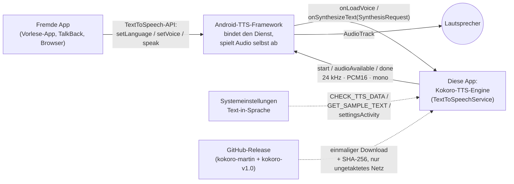
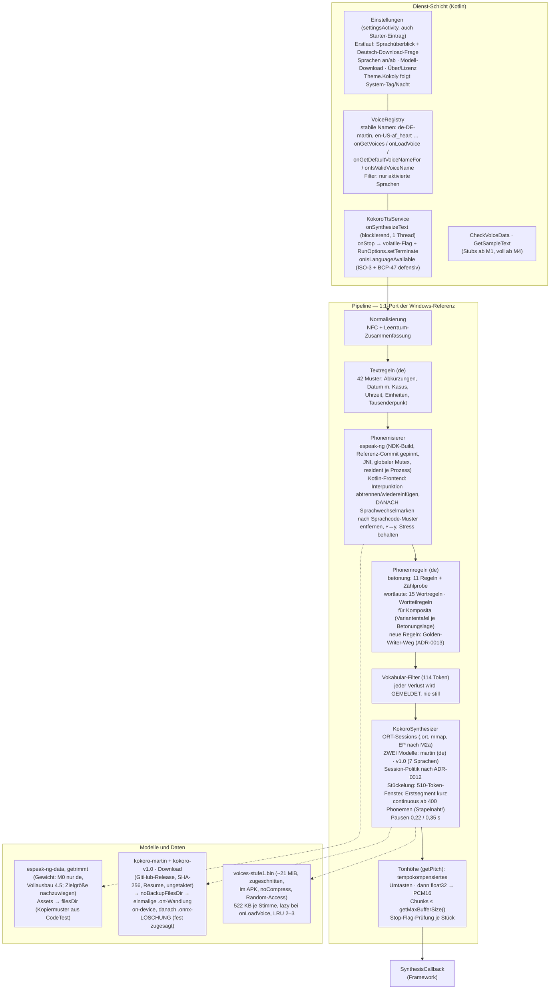

# Architektur — Kokoly

> arc42-light. **Dies ist der einzige Ort der gepflegten Diagramme** — Nachzug bei
> Architekturänderung im selben Commit (Definition of Done, Punkt 4).
> Stand: 31.08.2026 (M0–M5 umgesetzt und gerätegeprüft; M6 in Arbeit).

## 1. Ziele und Qualitätsziele

System-TTS-Ersatz für Android auf Basis Kokoro-82M. Qualitätsziele in dieser
Reihenfolge: (1) Aussprachequalität — Phonemgleichheit mit der vermessenen
Windows-Referenz; (2) Sparsamkeit — RAM-Korridor und mAh-Budgets aus
PROJEKTPLAN §6; (3) Wartbarkeit — Regeln datengetrieben, jede Änderung mit
Golden-Test. Vollständige Ziele: PROJEKTPLAN §1.

## 2. Kontext und Bausteine

### Kontext (C4-Ebene 1)

Kernpunkte des Vertrags (`docs/recherche/feld1`): `onSynthesizeText` läuft blockierend auf genau **einem** Synthese-Thread; `onStop` kommt von einem **anderen** Thread (→ volatile-Abbruchflag **und** `RunOptions.setTerminate()`, denn die teure Einheit ist der Modell-Run, nicht der PCM-Chunk); `audioAvailable` blockiert bei vollen Puffern (eingebaute Backpressure = Energiesparen — sie wirkt allerdings nur **zwischen** Modell-Runs, weshalb die Segmentlänge ein eigener Mess-Parameter ist); Chunks ≤ `getMaxBufferSize()` (8192 Bytes im Wiedergabepfad, immer abfragen); Sprachcodes kommen als **ISO-3** an (`"deu"`); nach Stop liefert `audioAvailable` den Rückgabewert `STOPPED`.

### Bausteine (C4-Ebene 2/3)

Die Textregel-Schicht ist sprachabhängig (Stufe 1: nur de vollständig; andere Sprachen laufen roh durch espeak — wie heute auf Windows). Für Nicht-de-Sprachen entfallen TXT/PR, NORM/PHON/VOC/KOK gelten immer.

**Querschnittsfestlegung espeak-Lebenszyklus (berichtigt 25.08.2026):** espeak wird **einmal je Prozess** initialisiert und bleibt resident **bis zum Prozessende**; `setVoice` nur bei tatsächlichem Sprachwechsel. `espeak_Terminate` wird im Dienstbetrieb **nie** gerufen — Dienst-`onDestroy` ist nicht Prozessende: ein Engine-Wechsel in den Systemeinstellungen zerstört den Dienst und bindet ihn im **selben Prozess** neu an; ein Terminate in `onDestroy` machte die Engine danach stumm (Nutzerfund, nachgestellt in DienstNeustartTest). `EspeakNative.init` ist idempotent und wird in `EnginePipeline.starte` vor jeder Abkürzung gerufen (selbstheilend). Der Leerlauf-Timer (umgesetzt 31.08.2026, Vorgabe 5 min, Daemon-Uhr ohne Wakelock/Alarm — schläft das Gerät, feuert die Prüfung später) entlädt **nur** ORT-Sessions, nie espeak; Wiederaufbau 0,8–1,0 s. Der residente RAM-Anteil wird in M2a einmal gemessen und steht als eigene Zeile im Korridor 6.2.

**Pflegeregel Diagramme:** Gepflegt wird ausschließlich `docs/architektur.md`, bei jeder Architekturänderung **im selben Commit** (Definition of Done, Punkt 4). Ein einmaliges Komponentendiagramm des Pipeline-Kerns entsteht in M3 und wird nur bei Pipeline-Umbauten angefasst. Mermaid-`flowchart`-Syntax, nicht die experimentelle C4-Syntax; > 15 Knoten → aufteilen.

---

## 3. Lösungsstrategie

1:1-Port der vermessenen Windows-Pipeline (ADR-0001); espeak-ng per NDK-Build
gepinnt (ADR-0002); zwei ONNX-Modelle, Session-Politik nach Messung (ADR-0012);
Regelwerke als datennahe Kotlin-Tabellen (ADR-0006). Alle Entscheidungen:
[docs/adr/](adr/).

## 4. Laufzeitsicht

*(entsteht mit M1 — der Weg eines onSynthesizeText-Aufrufs.)*

## 5. Querschnittskonzepte

Die neun Nicht-Verhandelbaren samt Messbelegen: [erkenntnisse.md](erkenntnisse.md).
espeak-Lebenszyklus: einmal je Prozess, resident bis zum Prozessende, kein
terminate im Dienstbetrieb (Festlegung oben, berichtigt 25.08.2026); der
Leerlauf-Timer entlädt nur ORT-Sessions. Stop-Pfad: volatile-Flag je Block +
RunOptions.setTerminate() im laufenden Run; Lauf/Schließen der ORT-Session
über faires RW-Lock synchronisiert.

## 6. Risiken und technische Schulden

- Martin-Lizenzkette: belegt mit benannten Restunschärfen
  ([lizenz/martin-kette.md](lizenz/martin-kette.md), F1: Mittelweg —
  HF-Quelle gepinnt, Sicherungen + Umschwenkplan beim Betreiber).
- ja/zh fehlen in Stufe 1 (ADR-0003).
- Vokoder nicht bitstabil (seedlose Zufallsknoten) — Golden-Tests prüfen Phoneme.
- Energie/RAM seit M2a/M5 gemessen (erkenntnisse.md); offen bleibt nur die
  Energie der v1.0-fp16-Gruppe (Wiedervorlage in ADR-0017).

## Begriffstafel

| deutsch (Doku) | englisch (Code) |
|---|---|
| Regelwerk | rules |
| Betonung | stress |
| Wortlaute | word pronunciations |
| Stimmenverzeichnis | VoiceRegistry |
| Vokabularfilter | vocabulary filter |
| Stapelnaht | batch seam |
